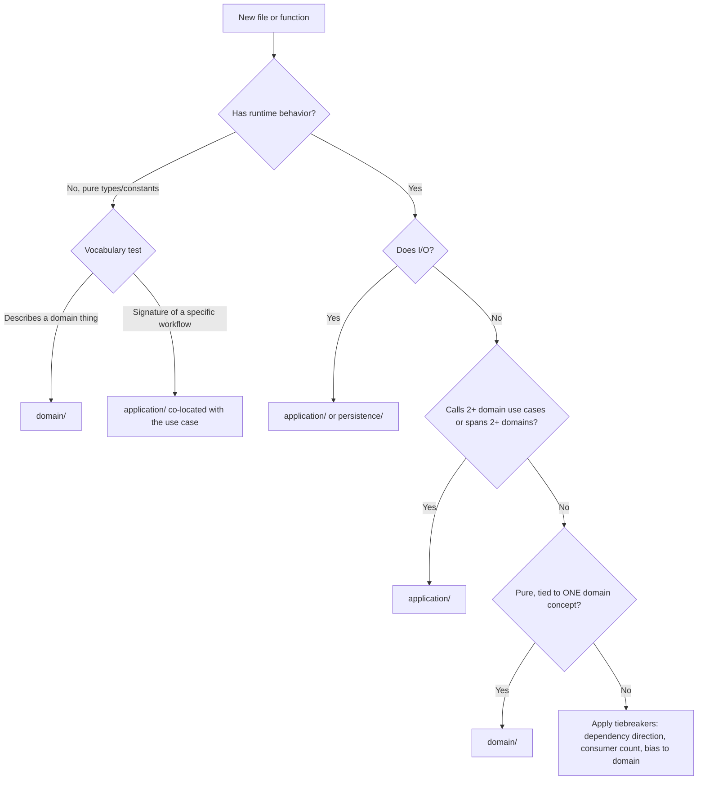

## API Design

## Architecture

Five layers, each with a single responsibility:

| Layer              | Location           | Knows about                                  |
| ------------------ | ------------------ | -------------------------------------------- |
| **HTTP layer**     | `src/app/api/`     | Requests, responses, auth context            |
| **Application**    | `src/application/` | Orchestration across domains and persistence |
| **Domain**         | `src/domain/`      | Types, constants, pure business rules        |
| **Persistence**    | `src/persistence/` | DTOs, Prisma queries, data mapping           |
| **Infrastructure** | `src/lib/`         | Prisma client, env, response helpers, policy |

**The golden rule: dependencies only flow downward.**

- Route handlers import from application, domain, persistence, and lib
- Application imports from domain, persistence, and lib
- Domain imports from lib only (pure types and use cases — no I/O)
- Persistence imports from lib and domain (types only)
- Lib imports nothing from your app

Prisma never appears in `src/app/api/`. HTTP concepts (`NextResponse`, status codes) never appear in domain, persistence, or application layers.

---

## Auth Responsibility Split

| Layer            | Responsibility                                     | Failure response             |
| ---------------- | -------------------------------------------------- | ---------------------------- |
| `middleware.ts`  | Protect **pages** — redirect unauthenticated users | Redirect to appropriate page |
| `routeHandler`   | Protect **API endpoints** — resolve identity       | `401` / `403` JSON           |
| **Domain layer** | Enforce **business rules**                         | Throws domain errors         |

---

## Folder Structure

```
src/
  domain/
    posts/
      posts.model.ts        ← TypeScript types
      const.ts              ← Constants and enums
      use-cases/
        createPost.ts       ← Pure business-rule functions
        validatePost.ts
    users/
      user.ts
      const.ts
      use-cases/
  persistence/
    posts/
      posts.dto.ts          ← Zod DTOs for validation
      posts.persistence.ts  ← Prisma queries + data mapping
  application/
    posts/
      createPost.ts         ← Orchestrates domain + persistence
  lib/
    prisma.client.ts        ← Prisma singleton (exists)
    apiResponse.ts          ← Response shape helpers (to be created)
    errors.ts               ← Domain error classes (to be created)
    policy.ts               ← Ownership checks (to be created)
    routeHandler.ts         ← Central wrapper (to be created)
  app/
    api/
      posts/
        route.ts            ← Thin coordinator
        [id]/
          route.ts
middleware.ts
```

---

## `src/lib/errors.ts` — Domain Errors

Typed errors that the domain and persistence layers throw. The `routeHandler` catches these and maps them to HTTP responses — keeping HTTP concerns out of your domain entirely.

```ts
export class NotFoundError extends Error {
  constructor(message = 'Not found') {
    super(message)
    this.name = 'NotFoundError'
  }
}

export class ValidationError extends Error {
  constructor(message: string) {
    super(message)
    this.name = 'ValidationError'
  }
}

export class ForbiddenError extends Error {
  constructor(message = 'Forbidden') {
    super(message)
    this.name = 'ForbiddenError'
  }
}
```

---

## `src/lib/apiResponse.ts` — Consistent Response Shapes

```ts
import { NextResponse } from 'next/server'

export type ApiSuccess<T> = { data: T; error: null }
export type ApiError = { data: null; error: string }

export const successResponse = <T>(data: T, status = 200) =>
  NextResponse.json<ApiSuccess<T>>({ data, error: null }, { status })

export const errorResponse = (message: string, status = 400) =>
  NextResponse.json<ApiError>({ data: null, error: message }, { status })

export const notFound = (msg = 'Not found') => errorResponse(msg, 404)
export const unauthorized = (msg = 'Unauthorized') => errorResponse(msg, 401)
export const forbidden = (msg = 'Forbidden') => errorResponse(msg, 403)
export const serverError = (msg = 'Internal server error') =>
  errorResponse(msg, 500)
export const validationError = (msg: string) => errorResponse(msg, 422)
```

## `src/lib/policy.ts` — Auth Context & Ownership

```ts
import { auth } from '@clerk/nextjs/server'
import { unauthorized, forbidden } from '@/lib/apiResponse'

export interface AuthContext {
  userId: string
}

export async function getAuthContext(): Promise<AuthContext | Response> {
  const { userId } = await auth()
  if (!userId) return unauthorized()
  return { userId }
}

export function assertOwner(
  ctx: AuthContext,
  resourceUserId: string
): Response | null {
  if (ctx.userId === resourceUserId) return null
  return forbidden()
}
```

---

## `src/lib/routeHandler.ts` — The Central Wrapper

Handles auth, body validation, and error mapping in one place. Domain errors thrown by use cases and persistence are caught here and converted to HTTP responses.

```ts
import { NextRequest } from 'next/server'
import { ZodSchema } from 'zod'
import { getAuthContext, AuthContext } from '@/lib/policy'
import {
  validationError,
  serverError,
  errorResponse,
  notFound,
  forbidden
} from '@/lib/apiResponse'
import { NotFoundError, ValidationError, ForbiddenError } from '@/lib/errors'
import { Prisma } from '@/app/generated/prisma/client'
import { logger } from '@/utils/logger'

type RouteParams = Record<string, string>

interface HandlerContext<TBody, TParams extends RouteParams> {
  req: NextRequest
  params: TParams
  body: TBody
  auth: AuthContext | undefined
}

interface RouteHandlerOptions<TBody, TParams extends RouteParams> {
  protected?: boolean
  bodySchema?: ZodSchema<TBody>
  handler: (ctx: HandlerContext<TBody, TParams>) => Promise<Response>
}

export function routeHandler<
  TBody = never,
  TParams extends RouteParams = RouteParams
>(options: RouteHandlerOptions<TBody, TParams>) {
  const { protected: requireAuth = true, bodySchema, handler } = options

  return async (
    req: NextRequest,
    ctx: { params: Promise<TParams> }
  ): Promise<Response> => {
    try {
      // 1. Auth
      let authCtx: AuthContext | undefined
      if (requireAuth) {
        const result = await getAuthContext()
        if (result instanceof Response) return result
        authCtx = result
      }

      // 2. Params
      const params = await ctx.params

      // 3. Body validation
      let body = undefined as TBody
      if (bodySchema) {
        const raw = await req.json().catch(() => null)
        const parsed = bodySchema.safeParse(raw)
        if (!parsed.success)
          return validationError(parsed.error.errors[0].message)
        body = parsed.data
      }

      // 4. Run handler
      return await handler({ req, params, body, auth: authCtx })
    } catch (error) {
      // Domain errors — thrown by services, mapped to HTTP here
      if (error instanceof NotFoundError) return notFound(error.message)
      if (error instanceof ValidationError)
        return validationError(error.message)
      if (error instanceof ForbiddenError) return forbidden(error.message)

      // Prisma errors
      if (error instanceof Prisma.PrismaClientKnownRequestError) {
        if (error.code === 'P2002') return errorResponse('Already exists', 409)
        if (error.code === 'P2025') return notFound()
      }

      logger.error({
        message: `Unhandled API error: ${req.method} ${req.nextUrl.pathname}`,
        error: error instanceof Error ? error : undefined
      })
      return serverError()
    }
  }
}
```

---

## Layer Patterns

### Domain — `src/domain/{entity}/`

Domain entities hold types, constants, and pure use-case functions (no I/O, no Prisma). This matches the existing codebase pattern.

```
src/domain/posts/
  posts.model.ts    ← Types
  const.ts          ← Constants
  use-cases/
    validatePostSchedule.ts
```

```ts
// src/domain/posts/use-cases/validatePostSchedule.ts
import { ValidationError } from '@/lib/errors'

export function validatePostSchedule(scheduledAt: Date | undefined): void {
  if (scheduledAt && scheduledAt < new Date()) {
    throw new ValidationError('Cannot schedule a post in the past')
  }
}
```

### Persistence — `src/persistence/{entity}/`

Persistence functions handle all Prisma queries. They return DTOs and throw domain errors when records are missing.

```
src/persistence/posts/
  posts.dto.ts            ← Zod schemas and inferred types
  posts.persistence.ts    ← Prisma queries
```

```ts
// src/persistence/posts/posts.dto.ts
import { z } from 'zod'

export const createPostDto = z.object({
  title: z.string().min(1).max(200),
  content: z.string().min(1),
  scheduledAt: z.coerce.date().optional()
})

export const updatePostDto = createPostDto.partial()

export type CreatePostDto = z.infer<typeof createPostDto>
export type UpdatePostDto = z.infer<typeof updatePostDto>
```

```ts
// src/persistence/posts/posts.persistence.ts
import 'server-only'

import { prisma } from '@/lib/prisma.client'
import { NotFoundError } from '@/lib/errors'
import type { CreatePostDto, UpdatePostDto } from './posts.dto'

export async function findPostsByUserId(userId: string) {
  return prisma.post.findMany({
    where: { userId },
    orderBy: { createdAt: 'desc' }
  })
}

export async function findPostOrThrow(id: string) {
  const post = await prisma.post.findUnique({ where: { id } })
  if (!post) throw new NotFoundError('Post not found')
  return post
}

export async function createPost(userId: string, data: CreatePostDto) {
  return prisma.post.create({ data: { ...data, userId } })
}

export async function updatePost(id: string, data: UpdatePostDto) {
  return prisma.post.update({ where: { id }, data })
}

export async function deletePost(id: string) {
  return prisma.post.delete({ where: { id } })
}
```

### Application — `src/application/{entity}/` (when needed)

Use the application layer when a route needs to orchestrate across multiple domains or persistence modules. Skip it for simple CRUD — route handlers can call persistence and domain use cases directly.

```ts
// src/application/posts/createPost.ts
import { validatePostSchedule } from '@/domain/posts/use-cases/validatePostSchedule'
import { createPost as persistPost } from '@/persistence/posts/posts.persistence'
import type { CreatePostDto } from '@/persistence/posts/posts.dto'

export async function createPost(userId: string, data: CreatePostDto) {
  validatePostSchedule(data.scheduledAt)
  return persistPost(userId, data)
}
```

---

## Route Handler Examples

Route handlers are thin coordinators: parse → check ownership → call persistence/use cases → respond. No Prisma, no business logic.

### Collection Route — `src/app/api/posts/route.ts`

```ts
import { routeHandler } from '@/lib/routeHandler'
import { successResponse } from '@/lib/apiResponse'
import { findPostsByUserId } from '@/persistence/posts/posts.persistence'
import { createPost } from '@/application/posts/createPost'
import { createPostDto } from '@/persistence/posts/posts.dto'

export const GET = routeHandler({
  handler: async ({ auth }) => {
    const posts = await findPostsByUserId(auth!.userId)
    return successResponse(posts)
  }
})

export const POST = routeHandler({
  bodySchema: createPostDto,
  handler: async ({ body, auth }) => {
    const post = await createPost(auth!.userId, body)
    return successResponse(post, 201)
  }
})
```

### Resource Route — `src/app/api/posts/[id]/route.ts`

```ts
import { routeHandler } from '@/lib/routeHandler'
import { successResponse } from '@/lib/apiResponse'
import { assertOwner } from '@/lib/policy'
import {
  findPostOrThrow,
  updatePost,
  deletePost
} from '@/persistence/posts/posts.persistence'
import { updatePostDto } from '@/persistence/posts/posts.dto'

export const GET = routeHandler({
  handler: async ({ params, auth }) => {
    const post = await findPostOrThrow(params.id)

    const denied = assertOwner(auth!, post.userId)
    if (denied) return denied

    return successResponse(post)
  }
})

export const PATCH = routeHandler({
  bodySchema: updatePostDto,
  handler: async ({ params, body, auth }) => {
    const post = await findPostOrThrow(params.id)

    const denied = assertOwner(auth!, post.userId)
    if (denied) return denied

    const updated = await updatePost(params.id, body)
    return successResponse(updated)
  }
})

export const DELETE = routeHandler({
  handler: async ({ params, auth }) => {
    const post = await findPostOrThrow(params.id)

    const denied = assertOwner(auth!, post.userId)
    if (denied) return denied

    await deletePost(params.id)
    return successResponse({ deleted: true })
  }
})
```

### Public Route

```ts
export const GET = routeHandler({
  protected: false,
  handler: async () => {
    const posts = await findFeaturedPosts()
    return successResponse(posts)
  }
})
```

### Optional Auth — public but personalized

```ts
export const GET = routeHandler({
  protected: false,
  handler: async ({ auth }) => {
    const posts = await findFeaturedPosts()

    if (auth) {
      // enhance response for authenticated users
    }

    return successResponse(posts)
  }
})
```

---

## `middleware.ts` — Page Protection Only

API routes are never mentioned here.

```ts
import { clerkMiddleware, createRouteMatcher } from '@clerk/nextjs/server'

const isProtectedPage = createRouteMatcher([
  '/dashboard(.*)',
  '/settings(.*)',
  '/profile(.*)'
])

export default clerkMiddleware(async (auth, req) => {
  if (isProtectedPage(req)) await auth.protect()
})

export const config = {
  matcher: ['/((?!_next|.*\\..*).*)']
}
```

---

## Extending the Policy Later

Add new assert functions to `lib/policy.ts` — nothing else changes.

```ts
export function assertMember(
  ctx: AuthContext,
  memberUserIds: string[]
): Response | null {
  if (memberUserIds.includes(ctx.userId)) return null
  return forbidden()
}

export function assertOwnerForMutation(
  ctx: AuthContext,
  resourceUserId: string,
  method: string
): Response | null {
  if (['PATCH', 'PUT', 'DELETE'].includes(method)) {
    return assertOwner(ctx, resourceUserId)
  }
  return null
}
```

---

## Rules Summary for Cursor

**Architecture**

- Route handlers import from persistence, domain, application, and lib — never import Prisma directly in `src/app/api/`
- Domain use cases are pure functions with no I/O — they live in `src/domain/{entity}/use-cases/`
- Persistence functions own all Prisma queries — they live in `src/persistence/{entity}/`
- Application functions orchestrate across domains and persistence — use only when needed
- No cross-domain imports — each domain folder owns its types, constants, and use cases

**Route handlers**

- Every new handler uses `routeHandler()` — no raw async functions exported directly
- `protected: false` must be explicit for public routes — auth is on by default
- On protected routes, `auth` is always `AuthContext` — use `auth!.userId` confidently
- On public routes, `auth` is `undefined` — always null-check before using it
- Route handlers only do: resolve auth → check ownership → call persistence/domain/application → return response

**Persistence**

- All Prisma queries live in `src/persistence/{entity}/{entity}.persistence.ts`
- DTOs (Zod schemas) live in `src/persistence/{entity}/{entity}.dto.ts`
- Persistence functions throw `NotFoundError` when records are missing
- Import Prisma as `import { prisma } from '@/lib/prisma.client'`

**Domain use cases**

- Pure functions — no Prisma, no HTTP, no side effects
- Throw domain errors (`NotFoundError`, `ValidationError`, `ForbiddenError`) for rule violations
- `routeHandler` catches domain errors and maps them to HTTP — use cases stay HTTP-agnostic

**Ownership**

- Always call `assertOwner` before returning or mutating a record
- Scope all list queries with `where: { userId }` in persistence — never return another user's records
- All assert functions return `Response | null` — always check `if (denied) return denied`
- `userId` on Prisma models is always a plain string (Clerk user ID) — never a foreign key relation

**Logging**

- Always use `logger` from `@/utils/logger` — never use `console.error` or `console.log`
- Use `logger.error` only for fatal errors; use `logger.warn` for non-fatal issues

**Existing routes**

- All API routes use the `routeHandler()` pattern — no legacy raw async function exports remain

---

## Domain vs Application Layer

# Domain vs Application Layer

## Key Distinction

| Aspect           | **Domain Layer**                  | **Application Layer**             |
| ---------------- | --------------------------------- | --------------------------------- |
| **Purpose**      | The model of the business         | Orchestration                     |
| **Contains**     | Business logic, rules, entities   | Coordinates domain + persistence  |
| **Answers**      | "What the business IS"            | "How we USE business rules"       |
| **Dependencies** | None on outer layers              | Uses domain layer                 |
| **Scope**        | Single domain concept             | Cross-domain workflows            |
| **Data**         | Receives data, applies pure logic | Loads data, coordinates, persists |

## Domain Layer Principles

1. **Pure functions** - No side effects, no I/O
2. **Single domain concept** - One entity/aggregate per use case
3. **No external dependencies** - No persistence, no APIs
4. **Highly testable** - No mocks needed

```typescript
// ✅ GOOD: Pure domain entity module
// domain/location/location.model.ts
export const getTitle = (location?: Partial<Location>): string =>
  location?.title || ''

export const isLocationCity = (location: Location): boolean =>
  getLocationType(location) === LOCATION_TYPE.CITY

export const isLocationLuxury = (location: Location): boolean =>
  !!location?.isLuxury

// ✅ GOOD: Pure single-domain use case
// domain/location/use-cases/isLocationInUnitedStates.ts
export const isLocationInUnitedStates = (location: Location): boolean => {
  const lowercaseUnitedStates = UNITED_STATES.toLowerCase()
  return getAllLocationTitles(location)
    .map((locationTitle) => locationTitle.toLowerCase())
    .join(' ')
    .includes(lowercaseUnitedStates)
}

// ✅ GOOD: Value object pattern with encapsulated rules
// domain/center/sponsorTier.ts
export const SponsorTierModule = {
  isSponsor: (tier: SponsorTierValueType): boolean =>
    setHas(SPONSOR_VALUES, tier),
  isPPV,
  isCapped,
  isPaused
} as const
```

## Application Layer Principles

1. **Orchestrates domain** - Calls domain use cases, doesn't duplicate them
2. **Coordinates cross-domain logic** - When multiple domains are involved
3. **Handles I/O** - Loads from persistence, persists results

```typescript
// ✅ GOOD: SEO orchestration in application layer
// application/seo/generatePageTitle.ts
// Uses domain use cases, coordinates page-specific composition
// without owning business rules

// ✅ GOOD: Application coordinates, domain decides
// Application imports and uses domain functions like:
// - isLocationPageType(pageType)
// - isInsurancePageType(pageType)
// - termToLowerCasePreservingAcronyms(title)
```

## Anti-Patterns (Real Examples from Legacy Code)

```typescript
// ❌ BAD: Business logic in API route
// api/sendInquiryForm.ts (legacy)
const handler = async (req, res) => {
  const blacklist = await getBlacklist()
  if (blacklist.includes(message) || blacklist.includes(email)) {
    return res.status(500).json({ message: 'Blacklisted' })
  }
  const centerData = await client.center.findFirst({ where: { slug } })
  // 170+ lines of email building mixed with API handling
}

// ❌ BAD: fetch() calls inside domain layer
// domain/benefits/verifyTxHelpers.js (legacy)
export const getPayers = async (benefitsKey) => {
  const response = await fetch(
    `https://api.verifytx.com/webforms/widgets/${benefitsKey}`
  )
  // Domain should NEVER make external calls
}

// ❌ BAD: Domain function calling repository/persistence
// domain/center/use-cases/getFeaturedCentersRelatedToCenterLocation.ts (legacy)
import { fetchFeaturedCenters } from '@/repository/center/fetchFeaturedCenter'
export const getFeaturedCentersRelatedToCenterLocation = async ({ center }) => {
  return await fetchFeaturedCenters({ location }) // Wrong!
}
```

## Deciding if a file belongs in domain or application

Use these three tests in order. Stop at the first one that gives a clear answer.

### 1. Orchestration rubric (for code with runtime behavior)

It's **application** if ANY of these is true:

- Calls 2+ domain use cases and combines their outputs
- Does I/O (persistence, services, storage, env)
- Sequences a feature-specific workflow
- Is specific to one application feature, not a reusable rule

If none match, it's **domain**.

### 2. Vocabulary vs verb test (for pure types or constants)

Pure types and constants have no behavior, so the orchestration rubric doesn't apply. Ask instead:

- Describes a **thing** the business has (Center, Location, PageType, a resolved slug) → **domain**
- Describes the **signature of a specific workflow** (input/output types of one orchestrator) → **application**, co-located with that use case

### 3. Tiebreakers (when 1 and 2 still feel 50/50)

Apply in order:

1. **Dependency direction is a hard rule.** Domain must not import from application. If any current or plausible-future domain use case needs this, it **must** be in domain.
2. **Consumer count.** Used across 3+ layers (e.g. `app/` + `application/` + `persistence/`) → domain. Used inside one application feature → application.
3. **Cost of being wrong.** Bias toward domain for pure code — cheap to move out later, expensive to move in (risks circular imports or duplication).

### Decision flow



### Concrete examples from this codebase

| File or function                                               | Layer           | Why                                                                                   |
| -------------------------------------------------------------- | --------------- | ------------------------------------------------------------------------------------- |
| `getCenterProfileSlug(center)` in `domain/center/center.model.ts` | **domain**      | Pure, single entity, no I/O. Rule 1 fails all 4 signals.                              |
| `computeBreadCrumbs` in `application/page/computeBreadCrumbs.ts` | **application** | Dispatches across 5 page-type-specific computers and post-processes. Rule 1 triggers. |
| `ResolveSlugResponse` type in `domain/routing/routing.model.ts` | **domain**      | Pure vocabulary describing a resolved slug; consumed by API route, middleware, and `application/routing/resolveSlug.ts`. Rule 2 (vocabulary) + rule 3 (3+ layers). |
| `SITE_NAME` in `domain/seo/const.ts`                           | **domain**      | Domain vocabulary, not an orchestration knob. Rule 2.                                 |
| `NAV_LINKS` in `application/navBar/const.ts`                   | **application** | UI-only presentation copy for the nav; documented exception — not a business rule.    |

## Dependency Flow

```
app/ (Presentation) → application/ (Orchestration) → domain/ (Business Logic) → persistence/ (Data Access)
```

Pages call Application. Application calls Domain + Persistence. Domain is pure.

---

## Atomic Design & Component Creation

# Atomic Design Component Guidelines

## Core Principle: KISS (Keep It Simple, Stupid)

**Default behavior: Keep components inline in pages unless there's a clear reason to extract.**

Avoid premature abstraction. Only extract components when there's genuine benefit.

## Decision Tree: Should I Create a Component?

### Keep Inline (Default)

Extract to a separate component file **ONLY IF** at least one of these is true:

1. **Reusability**: Used in 2+ places (or will be soon)
2. **Server/Client Boundary**: Need `'use client'` in a Server Component page
3. **Complexity**: Section has complex logic worth testing separately
4. **File Size**: Page exceeds 500+ lines AND is hard to navigate

```tsx
// Good: Keep inline (page-specific, not reused)
export default function CareersPage() {
  return (
    <div>
      <div className="bg-seafoam-100">
        <h1>Join Recovery.com</h1>
      </div>
      <div>
        <h2>Benefits</h2>
      </div>
      <div>
        <h2>Our Values</h2>
      </div>
    </div>
  )
}

// Bad: Over-engineering page-specific content
import { CareersHero } from '@/components/organisms/CareersHero/CareersHero'
import { CareersBenefits } from '@/components/organisms/CareersBenefits/CareersBenefits'
```

### Extract to Component (Only When Necessary)

**Server/Client Boundary:**

```tsx
// Good: Extract because of 'use client' requirement
// File: components/molecules/ScrollToButton/ScrollToButton.tsx
'use client'
export const ScrollToButton = ({ targetId, children }) => {
  const handleClick = () => {
    document.getElementById(targetId)?.scrollIntoView({ behavior: 'smooth' })
  }
  return <Button onClick={handleClick}>{children}</Button>
}
```

**Genuine Reusability:**

```tsx
// Good: Used in multiple pages
// File: components/organisms/Paylocity/Paylocity.tsx
export const Paylocity = async () => {
  const { jobs } = await fetchPaylocityJobs()
  return <JobsList jobs={jobs} />
}
```

## Atomic Design Hierarchy

### Atoms (Basic Building Blocks)

- Basic HTML elements with styling
- No composition, single responsibility
- Highly reusable
- Examples: `Button`, `Input`, `Icon`, `Badge`, `Spinner`

```tsx
// Good: Reusable atom
export const Button = ({ children, onClick, variant }) => (
  <button
    className={buttonVariants({ variant })}
    onClick={onClick}
  >
    {children}
  </button>
)

// Bad: Too specific for an atom
export const SubmitContactFormButton = () => (
  <button>Submit Contact Form</button>
)
```

### Molecules (Simple Combinations)

- Combines 2-3 atoms
- Single, focused purpose
- Still fairly generic
- Examples: `SearchBar` (Input + Button), `FormField` (Label + Input + Error)

```tsx
// Good: Reusable molecule
export const ScrollToButton = ({ targetId, children }) => {
  const handleClick = () => {
    document.getElementById(targetId)?.scrollIntoView({ behavior: 'smooth' })
  }
  return <Button onClick={handleClick}>{children}</Button>
}

// Bad: Page-specific, should be inline
export const CareersPageScrollButton = () => (
  <Button onClick={() => scrollToOpenings()}>See Positions</Button>
)
```

### Organisms (Complex Sections)

- Complex UI combining molecules + atoms
- Feature-complete sections
- React providers and context components
- Examples: `Header`, `Footer`, `Paylocity`, `AnalyticsProvider`

```tsx
// Good: Reusable organism
export const Paylocity = async () => {
  const { jobs, error } = await fetchPaylocityJobs()
  if (error) return <ErrorState />
  if (isEmptyArray(jobs)) return <EmptyState />
  return <JobsList jobs={jobs} />
}

// Bad: Page-specific section, should be inline
export const CareersBenefitsSection = () => (
  <div>
    <h2>Benefits</h2>
    <ul>
      <li>401k</li>
      <li>Health Insurance</li>
    </ul>
  </div>
)
```

## Server Components vs Client Components

Server Components are the default in Next.js. Only use `'use client'` when necessary.

**Extract** when client interactivity is needed in a Server Component page.
**Keep inline** when content is static and page-specific.

## File Structure

### Core Convention

Every extracted component lives in a **self-named folder** with its test file. No standalone component files -- every component gets a folder because it should have a test.

### Atoms & Molecules

Self-named folder with the component file and its test. No sub-folders, no sub-components.

```
atoms/Button/
├── Button.tsx
└── Button.test.tsx

molecules/StarRatings/
├── StarRatings.tsx
└── StarRatings.test.tsx
```

### Simple Organisms

Same self-named folder pattern:

```
organisms/Footer/
├── Footer.tsx
└── Footer.test.tsx
```

### Complex Organisms (Feature Folder)

Organisms **may** include sub-components, sub-folders, variations, and shared internals when complexity warrants it. This is the only level where sub-folders are allowed.

```
organisms/TopNav/
├── TopNav.tsx                  ← public entry point
├── TopNav.test.tsx
├── LandingPageTopNav.tsx       ← variation
├── shared/                     ← internal helpers
│   ├── HiddenSSR.tsx
│   └── RecoveryComLogoLinked.tsx
├── DesktopNav/
│   ├── DesktopNav.tsx
│   ├── menus/
│   │   ├── TreatmentMegaMenu.tsx
│   │   └── LocationMegaMenu.tsx
│   └── panels/
│       ├── TreatmentPanel.tsx
│       └── LocationPanel.tsx
└── MobileNav/
    ├── MobileNav.tsx
    └── pages/
        ├── TreatmentMenu.tsx
        └── LocationMenu.tsx
```

### Structure Summary

| Level    | Structure                       | Sub-folders allowed |
| -------- | ------------------------------- | ------------------- |
| Atom     | Self-named folder + test        | No                  |
| Molecule | Self-named folder + test        | No                  |
| Organism | Self-named folder + test + subs | Yes                 |

### Imports

Always import directly from the source file. No barrel files with runtime exports (enforced by the Barrel Files section in the `recovery/code-standards` tile).

Library components from `@rehabpath/core-components` are imported directly from the package — that is not a barrel file. See the Core Components Library section in the `recovery/frontend` tile for which components live in the library vs locally.

```ts
// Good — local component
import { TopNav } from '@/components/organisms/TopNav/TopNav'
import { DesktopNav } from '@/components/organisms/TopNav/DesktopNav/DesktopNav'

// Good — library component (Button lives in @rehabpath/core-components, not locally)
import { Button } from '@rehabpath/core-components'

// Bad — local barrel file
import { TopNav } from '@/components/organisms/TopNav'
```

## Red Flags: Over-Engineering

**You're over-engineering if:**

1. Creating components for single-use page sections
2. File names include page names (`CareersHero`, `AboutHeader`)
3. Creating a component for every `<div>` section
4. "Just in case we need it later" (YAGNI violation)
5. Component has no props (too specific)

## Migration

When touching an existing component that is a standalone file (e.g., `organisms/Footer.tsx`):

1. Create the self-named folder: `organisms/Footer/`
2. Move the component into it: `organisms/Footer/Footer.tsx`
3. Add a test file: `organisms/Footer/Footer.test.tsx`
4. Update all imports to point to the new path
5. Remove any barrel `index.ts` that re-exports runtime code

---

## Dependency Placement

# Dependency Placement

When adding or moving packages in `package.json`, place them in the correct section so that `pnpm install --prod` includes everything needed to **build and run** the app.

## `dependencies` (production)

Packages required to **build** or **run** the application:

- Runtime libraries (React, Next.js, Axios, Zod, etc.)
- CSS/styling toolchains consumed during `next build` (Tailwind CSS, PostCSS plugins, Tailwind plugins, styled-components)
- Database clients (Prisma client, pg)
- Any package imported at build time or runtime

## `devDependencies` (development only)

Packages used **only** for local development, testing, or code quality:

- Type definitions (`@types/*`)
- Linters and formatters (ESLint, Prettier)
- Test frameworks (Jest, Testing Library)
- Code generators and CLI tools (Prisma CLI, shadcn, Vercel CLI)
- Git hooks (Husky, lint-staged)
- Build-time-only compilers that are NOT required by `next build` (e.g., Babel plugins used only in tests)

## Examples

```jsonc
// Good: Tailwind and its plugins in dependencies (needed by next build)
"dependencies": {
  "tailwindcss": "^4",
  "@tailwindcss/postcss": "^4",
  "@tailwindcss/forms": "^0.5.11",
  "@tailwindcss/typography": "^0.5.19"
}

// Bad: Tailwind plugin split across both sections
"dependencies": {
  "@tailwindcss/forms": "^0.5.11"
}
"devDependencies": {
  "@tailwindcss/typography": "^0.5.19"  // inconsistent — needed for build
}
```

## Quick check

Before placing a package, ask: **"Is this package needed when running `pnpm install --prod && pnpm build && pnpm start`?"**

- Yes -> `dependencies`
- No -> `devDependencies`

---

## Environment Variables

# Environment Variables

Never use `process.env` directly in the codebase.

Use the centralized environment module at `src/lib/env.ts` instead.

## Accessing Environment Variables

### Client Environment Variables (NEXT*PUBLIC*\*)

Use `clientEnv` for browser-accessible variables:

```ts
import { clientEnv } from '@/lib/env'

const apiKey = clientEnv.NEXT_PUBLIC_ALGOLIA_API_KEY
const segmentKey = clientEnv.NEXT_SEGMENT_KEY
```

### Server Environment Variables

Use `serverEnv` for server-only variables (API routes, server components):

```ts
import { serverEnv } from '@/lib/env'

const databaseUrl = serverEnv.DATABASE_URL
const sentryDsn = serverEnv.SENTRY_DSN
```

### Development Mode Check

Use `IS_DEVELOPMENT` instead of checking `process.env.NODE_ENV`:

```ts
import { IS_DEVELOPMENT } from '@/lib/env'

if (IS_DEVELOPMENT) {
  logger.debug({ message: 'Debug info' })
}
```

## Adding New Environment Variables

1. Add the variable to the appropriate schema in `src/lib/env.ts`:

```ts
// For client variables (NEXT_PUBLIC_*)
const clientSchema = z.object({
  // ... existing variables
  NEXT_PUBLIC_NEW_VARIABLE: z.string().optional()
})

// For server variables
const serverSchema = z.object({
  // ... existing variables
  NEW_SERVER_VARIABLE: z.string().optional()
})
```

2. Add the variable to the validation function:

```ts
// In validateClientEnv()
const parsed = clientSchema.safeParse({
  // ... existing variables
  NEXT_PUBLIC_NEW_VARIABLE: process.env.NEXT_PUBLIC_NEW_VARIABLE
})
```

3. Use the variable via `clientEnv` or `serverEnv`

## Bad vs Good Examples

### ❌ Bad: Direct process.env access

```ts
// Don't do this - triggers ESLint error
const apiKey = process.env.NEXT_PUBLIC_API_KEY
const isDev = process.env.NODE_ENV === 'development'
```

### ✅ Good: Using env module

```ts
import { clientEnv, IS_DEVELOPMENT } from '@/lib/env'

const apiKey = clientEnv.NEXT_PUBLIC_API_KEY
const isDev = IS_DEVELOPMENT
```

## Benefits

- **Type Safety**: All variables are validated with Zod schemas
- **Runtime Validation**: Missing required variables fail fast at startup
- **Centralized Configuration**: Single source of truth for all environment variables
- **IDE Support**: Full autocomplete and type checking
